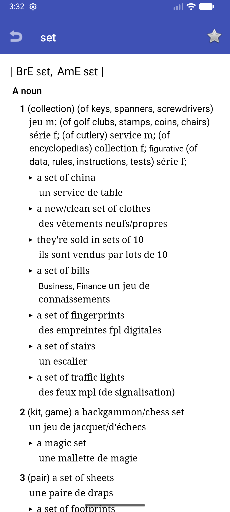
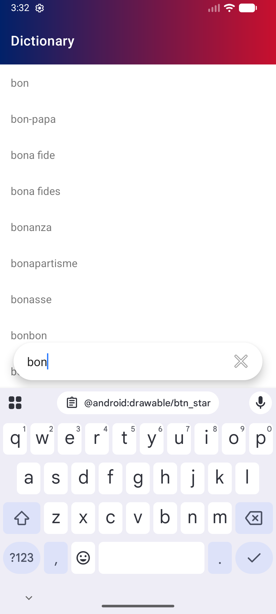
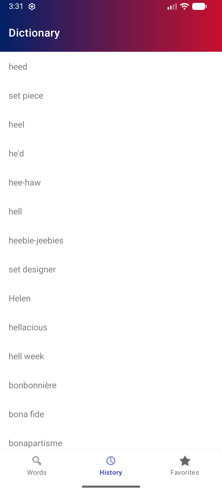

# Overview
Simple Android app that uses macOS dictionary.

Features:
- History
- Favorite

Dictionary is converted to a sqlite database.

Built partially by LLM.

## Screenshots 





## Build dictionary

Extraction script from https://github.com/solarmist/apple-peeler.

Any dictionary bundled in macOS can be used.

`DICT_BASE` path might have to be changed.

Example for French-English dictionary:
```
export DICT_BASE="/System/Library/AssetsV2/com_apple_MobileAsset_DictionaryServices_dictionary3macOS/"

cd database
pip3 install beautifulsoup4 click
python3 extract.py -d "French - English" > dictionary.xml
python3 build_dictionary_db.py dictionary.xml
cp dictionary.db ../app/src/main/assets/dictionary.db
```